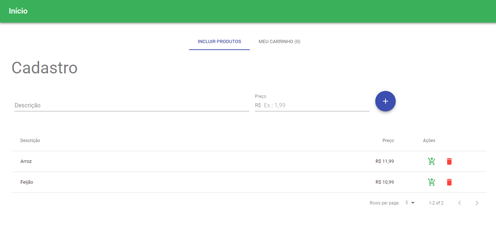
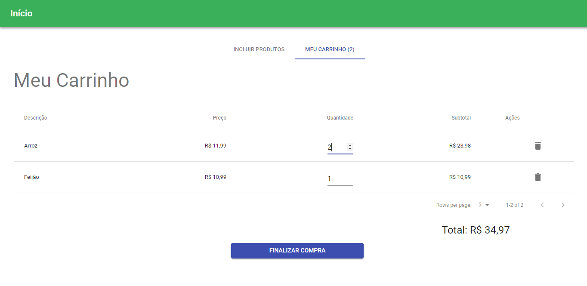

# Introdução

Esse aplicativo tem a finalidade de cadastrar produtos e adicioná-los a um carrinho de compras.

# Sobre o build

O app foi criado com a utilização das seguintes ferramentas:

Para o backend:
- Node;
- MongoDB;
- Express;
- Mongoose;

Para o frontend:
- Material-UI (e dependências);
- React;
- Redux;
- Webpack

# Preparação do ambiente

Para executar o aplicativo é necessário instalar o banco de dados NoSQL MongoDB. Para isso siga os seguintes passos:

- Faça o download do MongoDB Community Server versão 3.6.2 lançada em 05/01/2018 (arquivo .msi executável ou .zip compactado) encontrado no link https://www.mongodb.org/dl/win32/x86_64-2008plus-ssl?_ga=2.226666525.1887514483.1532536431-96078115.1532536431;
- Instale o executável em seu dispositivo;
- (Para Windows) Certifique-se de que nas Variáveis de ambiente, a variável de sistema Path esteja mapeada com o caminho da instalação do Mongo: ~\Program Files\MongoDB\Server\3.6\bin
- Dentro do diretório C: do seu dispositivo crie uma chamada chamada data e dentro de data crie uma pasta chamada db. O caminho deve ficar dessa forma no final: C:\data\db
- Abra o seu terminal e digite o seguinte comando: mongod
- Pronto! O banco mongoDB está rodando com sucesso@

# Execução

- Abra o terminal no seu computador e inicie o MongoDB através do comando mongod;

Em uma nova aba do terminal, no diretório de sua escolha siga os seguintes passos:

- git clone https://github.com/LuizHonorato/compra-certa.git

- Entre na pasta backend e execute o seguinte comando: npm i
- Após todas as dependências serem instaladas, execute o comando: npm run dev (ou npm run production para ambientes de produção);

- Em uma nova aba do terminal entre na pasta frontend e execute o seguinte comando: npm i
- Após todas as dependências serem instaladas, execute o comando: npm start

# Screenshots

